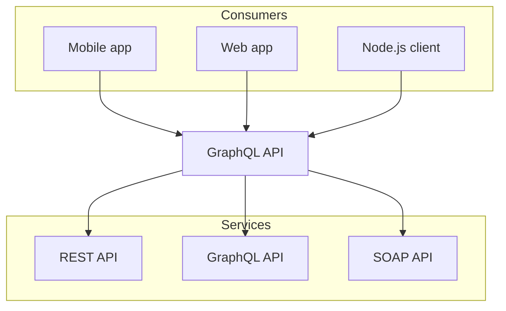

# Comprehensive Guide to Creating Documentation with Nextra

Nextra is a framework on top of Next.js, that lets you build content focused websites. It has all the great features from Next.js, plus extra power to create Markdown-based content with ease.

## Table of Contents

1. [Installation and Getting Started](#installation-and-getting-started)
2. [Creating Pages and Nested Pages](#creating-pages-and-nested-pages)
3. [Customizing Pages in meta.json](#customizing-pages-in-metajson)
4. [Adding Media and Downloads](#adding-media-and-downloads)
5. [Using Markdown](#using-markdown)
6. [Important Guides](#important-guides)
7. [Built-in Components](#built-in-components)
8. [Advanced Concepts](#advanced-concepts)

## 1. Installation and Getting Started

To start creating documentation with Nextra, follow these steps:

1. Create a new Next.js project:

   ```bash
   npx create-next-app my-docs
   cd my-docs
   ```

2. Install Nextra and the docs theme:

   ```bash
   npm install nextra nextra-theme-docs
   ```

3. Create a `next.config.js` file in your project root:

   ```javascript
   const withNextra = require("nextra")({
     theme: "nextra-theme-docs",
     themeConfig: "./theme.config.js",
   });
   module.exports = withNextra();
   ```

4. Create a `theme.config.js` file in your project root:

   ```javascript
   export default {
     logo: <span>My Project</span>,
     project: {
       link: "https://github.com/yourusername/your-repo",
     },
   };
   ```

5. Update your `package.json` scripts:
   ```json
   "scripts": {
     "dev": "next",
     "build": "next build",
     "start": "next start"
   }
   ```

Now you're ready to start creating your documentation!

## 2. Creating Pages and Nested Pages

Nextra uses a file-based routing system. Here's how to create pages and nested pages:

1. Create a `pages` directory in your project root.
2. Add Markdown (`.md`) or MDX (`.mdx`) files to create pages:
   ```
   pages/
   ├── index.md        # Home page
   ├── about.md        # /about
   └── docs/
       ├── index.md    # /docs
       ├── getting-started.md  # /docs/getting-started
       └── advanced/
           └── feature.md  # /docs/advanced/feature
   ```

## 3. Customizing Pages in meta.json

Use `meta.json` files to customize the sidebar and navigation:

1. Create a `meta.json` file in each directory:

   ```json
   {
     "index": "Introduction",
     "getting-started": "Getting Started",
     "advanced": "Advanced Topics"
   }
   ```

2. For nested pages, create a separate `meta.json`:
   ```json
   {
     "feature": "Advanced Feature"
   }
   ```

This allows you to control the order and naming of pages in the sidebar.

## 4. Adding Media and Downloads

### Images

Use Markdown syntax or Next.js Image component:

```markdown

```

or

```jsx
import Image from "next/image";

<Image src="/path/to/image.jpg" alt="Description" width={500} height={300} />;
```

### Links

Use Markdown syntax or Next.js Link component:

```markdown
[Link text](https://example.com)
```

or

```jsx
import Link from "next/link";

<Link href="/about">About Us</Link>;
```

### Videos

Embed videos using HTML:

```html
<iframe
  width="560"
  height="315"
  src="https://www.youtube.com/embed/VIDEO_ID"
  frameborder="0"
  allowfullscreen
></iframe>
```

### Downloads

Create links to downloadable files:

```markdown
[Download PDF](/path/to/document.pdf)
[Download PowerPoint](/path/to/presentation.pptx)
```

## 5. Using Markdown

Nextra supports standard Markdown syntax. Here are some common examples:

````markdown
    # Heading 1

    ## Heading 2

    ### Heading 3

    **Bold text**
    _Italic text_

    - Unordered list item
    - Another item
      - Nested item

    1. Ordered list item
    2. Another item

    > Blockquote

    `Inline code`

        ```python
          # Code block
          def hello_world():
              print("Hello, World!")
        ```

    | Column 1 | Column 2 |
    | -------- | -------- |
    | Row 1    | Data     |
    | Row 2    | Data     |

    [Link](https://example.com)

    
````

## 6. Important Guides

### Organize Files

- Use clear directory structures
- Group related content
- Use `meta.json` for customization

### Markdown

- Use Markdown for content creation
- Leverage MDX for advanced functionality

### Next.js Links

- Use `Link` component for internal navigation
- Improves performance with prefetching

### Next.js Image

- Use `Image` component for optimized images
- Provides lazy loading and responsive sizing

### Next.js SSG (Static Site Generation)

- Nextra uses Next.js SSG by default
- Generates static HTML at build time for better performance

## 7. Built-in Components

### Callout

```jsx
import { Callout } from "nextra/components";

<Callout emoji="💡">This is a callout with a lightbulb emoji.</Callout>;
```

### Tabs

```jsx
import { Tabs, Tab } from "nextra/components";

<Tabs items={["Tab 1", "Tab 2"]}>
  <Tab>Content for Tab 1</Tab>
  <Tab>Content for Tab 2</Tab>
</Tabs>;
```

### Cards

```jsx
import { Card, Cards } from "nextra/components";

<Cards>
  <Card title="Card 1" href="/link1">
    Description for Card 1
  </Card>
  <Card title="Card 2" href="/link2">
    Description for Card 2
  </Card>
</Cards>;
```

### Steps

```jsx
import { Steps } from "nextra/components";

<Steps>
  ### Step 1 Do this first ### Step 2 Then do this ### Step 3 Finally, do this
</Steps>;
```

### FileTree

```jsx
import { FileTree } from "nextra/components";

<FileTree>
  <FileTree.Folder name="pages" defaultOpen>
    <FileTree.File name="index.md" />
    <FileTree.File name="about.md" />
    <FileTree.Folder name="docs">
      <FileTree.File name="getting-started.md" />
    </FileTree.Folder>
  </FileTree.Folder>
</FileTree>;
```

### Bleed

```jsx
import { Bleed } from "nextra-theme-docs";

<Bleed>
  
</Bleed>;
```

## 8. Advanced Concepts

### Tailwind CSS

Tailwind CSS is a CSS framework that provides a set of pre-defined CSS classes to quickly style elements.

1. Install Tailwind CSS:

   ```bash
   npm install -D tailwindcss postcss autoprefixer
   npx tailwindcss init -p
   ```

   You can follow the official Tailwind CSS documentation for Next.js to set up Tailwind CSS for your Nextra project.

2. Configure `tailwind.config.js`
   To use Tailwind classes in your Markdown files, you will also need to add `.md` and `.mdx` files to the content list in `tailwind.config.js`:

   ```tsx copy filename="tailwind.config.js"
   /** @type {import('tailwindcss').Config} */
   module.exports = {
     content: [
       "./pages/**/*.{js,jsx,ts,tsx,md,mdx}",
       "./components/**/*.{js,jsx,ts,tsx,md,mdx}",

       // Or if using `src` directory:
       "./src/**/*.{js,jsx,ts,tsx,md,mdx}",
     ],
     theme: {
       extend: {},
     },
     plugins: [],
   };
   ```

3. Add Tailwind directives to your CSS
4. Use Tailwind classes in your MDX files

### Mermaid

Nextra supports mermaid diagrams. Like in GitHub you can use it in your markdown files by using the mermaid code block language. Out of the box, Nextra uses @theguild/remark-mermaid package that replaces the code block with the <Mermaid /> component.
Use the `mermaid` code block to create diagrams:

```tsx copy
graph TD;
subgraph AA [Consumers]
A[Mobile app];
B[Web app];
C[Node.js client];
end
subgraph BB [Services]
E[REST API];
F[GraphQL API];
G[SOAP API];
end
Z[GraphQL API];
A --> Z;
B --> Z;
C --> Z;
Z --> E;
Z --> F;
Z --> G;
```



### Rendering Tables

Use Markdown syntax or HTML for simple tables. For more complex tables, consider using a library like `react-table`.

### Remote Content

Fetch and display remote content using `getStaticProps`:

```jsx
export async function getStaticProps() {
  const res = await fetch("https://api.example.com/data");
  const data = await res.json();
  return { props: { data } };
}

export default function Page({ data }) {
  return <div>{data.title}</div>;
}
```

### TypeScript
1. Rename files to `.ts` or `.tsx`
2. Create a `tsconfig.json` file
3. Use TypeScript for type-safe development

```typescript
interface User {
  name: string;
  age: number;
}

const user: User = {
  name: "John Doe",
  age: 30,
};
```

This comprehensive guide should help you get started with creating documentation using Nextra, covering all the topics you requested. Remember to refer to the official Nextra documentation for the most up-to-date information and advanced features.
